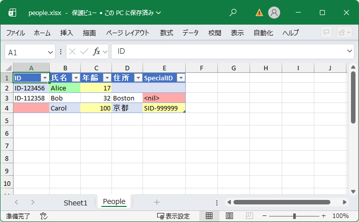

# exceltable

[](https://goreportcard.com/report/github.com/today2098/exceltable)
[](https://pkg.go.dev/github.com/today2098/exceltable)

[README (in English)](../README.md)

[excelize](https://github.com/qax-os/excelize) (`github.com/xuri/excelize/v2`) のシンプルなラッパーであり，Go の構造体をスプレッドシートのテーブルに書き出す機能を提供します．

## Features

- 構造体とスプレッドシートのテーブル間のマッピング
- 構造体タグを用いたヘッダ名，非表示設定のカスタマイズ
- 述語関数に基づく条件付きセルスタイリング（背景色による強調など）

## Example

出力例:



コード例:

```go
type Person struct {
    ID            string  `error:"zero"`
    Name          string  `csv:"name" excel:"氏名" newface:"isNewFace" error:"zero"`
    Age           int     `csv:"age" excel:"年齢" warn:"IsChild,IsOld"`
    Address       string  `csv:"address" excel:"住所"`
    AccountNumber string  `csv:"account_number" excel:"-"`
    SpecialID     *string `warn:"notZero" error:"nil"`
}

func (p *Person) IsChild() bool { // pointer receiver.
    return p.Age < 18
}

func (p Person) IsOld() bool { // value receiver.
    return 75 <= p.Age
}

func init() {
    exceltable.RegisterRule(0, "newface", &excelize.Style{ // custom style rule.
        Fill: excelize.Fill{
            Type:    "pattern",
            Pattern: 1,
            Color:   []string{"#aaffaa"},
        },
    })

    exceltable.RegisterPredicate("isNewFace", func(name string) bool { // predicate function.
        newFaces := []string{"Alice"}
        return slices.Contains(newFaces, name)
    })
}

func main() {
    aliceSpecialID := ""
    alice := &Person{
        ID:            "ID-123456",
        Name:          "Alice",
        Age:           17,
        Address:       "",
        AccountNumber: "0000-0000-0000-0000",
        SpecialID:     &aliceSpecialID,
    }

    bob := &Person{
        ID:            "ID-112358",
        Name:          "Bob",
        Age:           32,
        Address:       "Boston",
        AccountNumber: "1111-1111-1111-1111",
        SpecialID:     nil,
    }

    carolSpecialID := "SID-999999"
    carol := &Person{
        ID:            "",
        Name:          "Carol",
        Age:           100,
        Address:       "京都",
        AccountNumber: "",
        SpecialID:     &carolSpecialID,
    }

    f, _ := exceltable.NewFile()
    s, _ := exceltable.NewSheetWithStreamWriter[Person](f, "NewSheet", "A1", true)

    s.SetHeader()

    s.SetRow(alice)
    s.SetRow(bob)
    s.SetRow(carol)

    s.AddDefaultTable()
    s.Flush()

    f.SaveAs("NewBook.xlsx")
}
```

## Installation

```bash
go get github.com/today2098/exceltable@latest
```

## Usage

### 1. スタイルルールの登録

はじめに，「タグ名」「`excelize.Style`」「優先度」を指定し，スタイルルールを登録します．

ルールは優先度が高いものから評価され，最初に true を返した時点で後続のルールは評価されません．

```go
exceltable.RegisterRule(0, "newface", &excelize.Style{
    Fill: excelize.Fill{
        Type:    "pattern",
        Pattern: 1,
        Color:   []string{"#aaffaa"},
    },
})
```

デフォルトルール:

|タグ名|スタイル|優先度|
|---|---|---|
|`warn`|黄色背景 (`#ffffaa`)|98|
|`error`|赤背景 (`#ffaaaa`)|99|

### 2. スタイル適用条件（述語）の登録

次に，スタイルが適用される条件を示す述語を登録します．

適用条件を示す述語は，構造体のメソッドまたは関数として定義します．
述語関数は，無引数または対象フィールドの型を引数とする必要があります．

```go
exceltable.RegisterPredicate("isNewFace", func(name string) bool {
    newFaces := []string{"Alice"}
    return slices.Contains(newFaces, name)
})
```

デフォルト条件:

|条件名|説明|
|---|---|
|`always`|常に適用|
|`never`|常に適用しない|
|`zero`|フィールドがゼロ値|
|`notZero`|フィールドが非ゼロ値|
|`nil`|ポインタ型フィールドがnil|
|`notNil`|ポインタ型フィールドが非nil|

### 3. 構造体タグの追加

構造体のフィールドに対して，ヘッダ名やスタイル適用条件を示すタグを追加します．

ヘッダ名は「`excel` > `csv` > フィールド名」の順で決定されます．
非表示にしたいフィールドには `excel:"-"` を設定します．

スタイル適用条件はカンマ区切りで複数指定できます（OR条件）．

```go
type Person struct {
    ID            string  `error:"zero"`
    Name          string  `csv:"name" excel:"氏名" newface:"isNewFace" error:"zero"`
    Age           int     `csv:"age" excel:"年齢" warn:"IsChild,IsOld"`
    Address       string  `csv:"address" excel:"住所"`
    AccountNumber string  `csv:"account_number" excel:"-"`
    SpecialID     *string `warn:"notZero" error:"nil"`
}

func (p *Person) IsChild() bool {
    return p.Age < 18
}

func (p Person) IsOld() bool {
    return 75 <= p.Age
}
```

### 4. スプレッドシートへの書き出し

```go
f, _ := exceltable.NewFile()
s, _ := exceltable.NewSheetWithStreamWriter[Person](f, "NewSheet", "A1", true)

s.SetHeader()

s.SetRow(alice)
s.SetRow(bob)
s.SetRow(carol)

s.AddDefaultTable()
s.Flush()

f.SaveAs("NewBook.xlsx")
```

## License

This project is licensed under the MIT License.

It depends on [excelize](https://github.com/qax-os/excelize), which is licensed under the BSD 3-Clause License.
